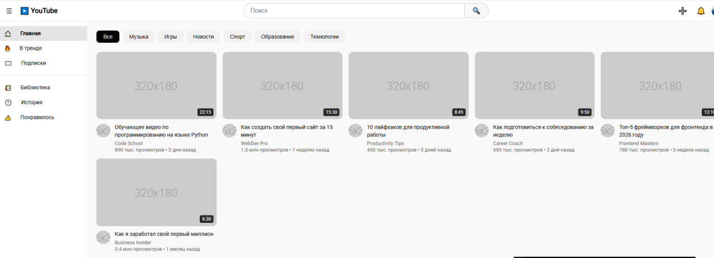
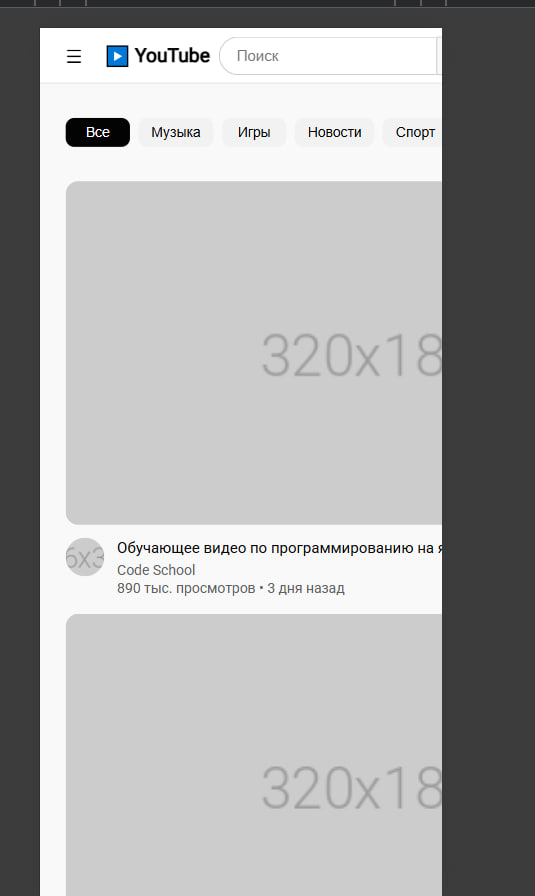

# YouTube Clone - Лабораторная работа №11

**Студент:** Лойко Арина Станиславна
**Группа:** ИСП-232

---

## Описание

Адаптивный клон главной страницы YouTube, созданный с использованием HTML, CSS, Flexbox и CSS Grid. Страница включает хедер с поиском, боковую панель, категории и сетку видео-карточек.

---

## Реализованные функции

- [x] Адаптивный хедер с поиском
- [x] Боковая панель навигации
- [x] Категории (чипсы) с интерактивностью
- [x] Сетка видео с карточками
- [x] Hover-эффекты на карточках
- [x] Полная адаптивность под все устройства

---

## Технологии

- HTML5
- CSS3
- Flexbox
- CSS Grid
- Media Queries

---

## Скриншоты

### Tablet (1024px)


### Mobile (575px)


---

## Как запустить

1. Откройте файл `index.html` в браузере
2. Или используйте **Live Server** в VS Code:
   - Установите расширение Live Server
   - Правой кнопкой по `index.html` - Open with Live Server

---

## Структура проекта

```
isrpo_lab11/
├── index.html
├── style.css
├── README.md
└── img/
```

---

## Вывод

В ходе выполнения лабораторной работы я научилась создавать сложные макеты с помощью Flexbox и CSS Grid. Освоила адаптивную вёрстку с медиа-запросами, научилась делать интерактивные элементы на чистом CSS. Проект помог лучше понять принципы построения современных веб-интерфейсов.

---

## Дата выполнения

16.02.2026
